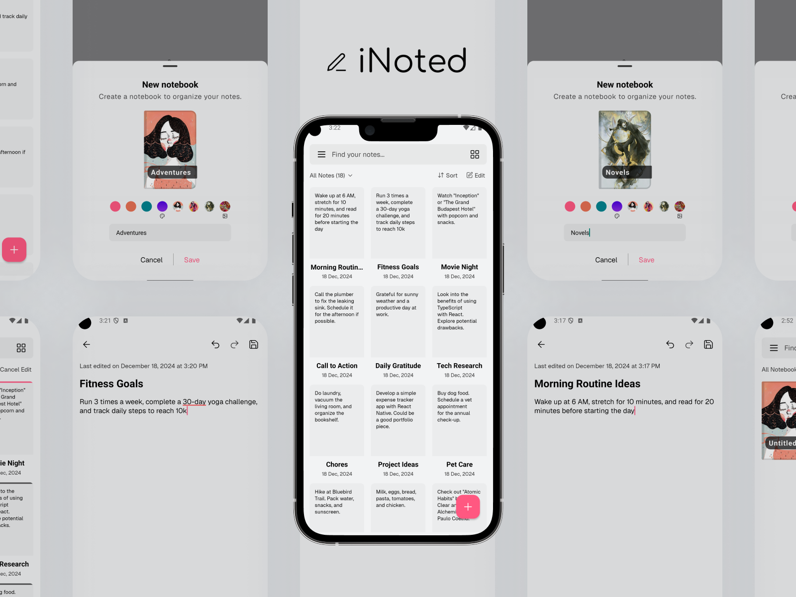

# iNoted - Quick & Intuitive Note-Taking

**iNoted** is a powerful mobile app designed for effortless note-taking and organization, ensuring your information remains completely private and secure. With **iNoted**, users can create, edit, and manage notes in customizable notebooks, making it easy to categorize and retrieve important information.

## Features

### 1. **Local Storage**

- All your notes are stored exclusively on your device, ensuring complete privacy and security. No data is sent to external servers, so you can rest easy knowing your information is safe.

### 2. **Notebook Organization**

- Keep your notes organized by saving them in dedicated notebooks. Easily create, rename, and delete notebooks to suit your needs.

### 3. **Intuitive Interface**

- Enjoy a simple and clean design that allows for quick access to your notes, making the note-taking experience smooth and efficient.

### 4. **Search Functionality**

- Quickly locate any note with a powerful search feature, saving you time and effort when you need to find specific information.

### 5. **Backup Options**

- Safeguard your notes with easy backup options, ensuring you never lose important information. You can back up your data locally or to your preferred storage solution.

### 6. \*_Share Notes_

- Effortlessly share your notes with friends or colleagues via various platforms, making collaboration easy and efficient.

## Technology Stack

- React Native
- TypeScript
- Expo
- Tailwind CSS
- Drizzle

## Contact

For any inquiries, feel free to reach me out at [alanbusinessnin@gmail.com](alanbusinessnin@gmail.com).
